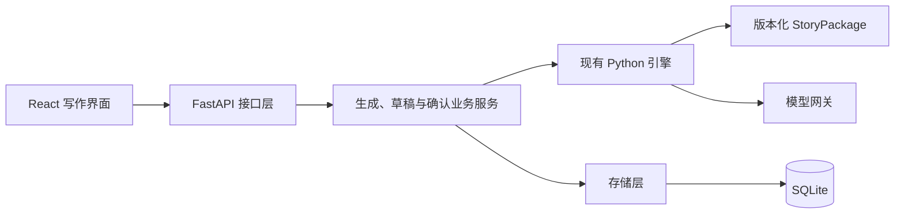

## 决策状态

- 确认日期：2026-09-09。
- 状态：架构选型已确认；首批读取 API 已实施；本轮不开发前端页面，生成及状态写入尚未开放。
- 2026-09-10：补齐前端读取准备，包括预览能力提示、会话绑定状态、分支目录分页与按需正文、明确响应模型和本机开发 CORS。可开始只读界面设计与接入；完整写作交互仍依赖后续草稿服务。
- 目标：快速验证“导入故事包 → 选择拍点与角色 → 装配局部上下文 → 生成与编辑草稿 → 确认并提交状态 → 继续下一节点”的业务闭环。
- 适用前提：第一版面向本机或少量用户的写作工作台；公网多人协作与离开页面后持续生成不属于本次已确认范围。

本文记录后续 API / Web 阶段的架构决策。[MVP 技术方案](architecture-mvp.md)仍描述当前 CLI 基线；其中暂不引入 Web 框架的约束适用于 CLI 验证阶段。本文不代表现有生成链路已验收通过，也不替代[真实模型验收记录](live-llm-evaluation-v0.1.md)与[Python 运行时验收门槛](python-migration-v0.1.md)。

## 已确认的技术组合

| 领域 | 选择 | 原因与边界 |
| --- | --- | --- |
| 后端语言与业务核心 | Python，复用 `open_story_engine/` | 保留已实现的故事包、上下文、生成、规则与账本能力，不重写为 TypeScript 后端。 |
| HTTP 接口框架 | FastAPI | 通过请求与响应模型表达接口契约，提供 OpenAPI 文档，支持后续流式响应。接口校验不能替代引擎的状态与事实校验。 |
| 前端 | React + TypeScript + Vite | 构建独立单页应用，承载拍点选择、正文编辑、上下文检查和确认流程。 |
| UI 组件库 | Ant Design（`antd`） | 现有树、分栏、输入、抽屉和反馈组件覆盖 MVP 需求，优先减少基础交互开发。 |
| 样式 | Ant Design 主题与少量自定义 CSS | 统一控件外观；正文区域单独设置阅读宽度、字号、行距和留白。 |
| 正文编辑 | 第一版使用 `Input.TextArea` 纯文本编辑 | 支持查看和修改生成草稿。段落批注、局部改写与版本差异出现明确需求后，再选独立编辑器。 |
| 前端状态 | React 自带状态能力 | 管理页面选择、草稿编辑和请求进度；已确认故事状态以服务端返回为准。共享状态复杂度上升后再评估专门状态库。 |
| 持久化 | SQLite，沿用现有 `sqlite3` 存储基础 | 保存会话、分支和账本；后续待确认草稿也需要服务端持久化，具体表结构待设计。 |
| 部署形态 | 单个后端应用，前端构建为静态文件 | 开发时分别运行 Vite 与 API；交付时同一站点提供页面和 `/api`，具体静态托管方式待实施时确定。 |

API 首批使用独立 Python 3.12 环境验证，依赖通过 `pyproject.toml` 的 `api` / `api-test` extras 与 `requirements-api.lock` 固定；CLI 核心仍保留 Python `>=3.9` 声明。前端选型仅作为后续规划，本轮没有前端代码或依赖安装要求。安装、启动与接口说明见[读取 API 服务](api-read-service-v0.1.md)。

## 后端职责与依赖方向

保持一个后端应用，按职责分层，不要求拆分为多个服务。

| 层次 | 职责 |
| --- | --- |
| 接口层 | 校验请求结构，传递会话与分支标识，返回结果、错误及必要的进度信息。 |
| 业务服务层 | 协调局部上下文、生成、草稿保存、编辑后复核和确认提交，定义重复请求与过期草稿行为。 |
| 引擎层 | 执行故事包加载、上下文装配、规则判定、正文生成和状态守卫；不依赖浏览器界面。 |
| 存储层 | 保存草稿与已确认数据，执行事务、请求去重和来源绑定。 |

模型密钥与网关调用保留在后端。前端不直接调用模型，也不依据正文自行推断人物位置、物品归属或剧情结果。

现有模型调用是同步执行路径。封装时须安排其执行方式，避免阻塞异步服务；SQLite 连接和 Planner 的可变状态须有明确的请求隔离及并发策略。选用 FastAPI 本身不代表这些问题已解决。

## 四个 MVP 模块与接口方向

以下路径沿用讨论中的规划名称。首批读取接口的实际契约见[使用说明](api-read-service-v0.1.md)，生成与确认部分仍为后续规划。

| 模块 | 规划接口 | 业务边界与待补契约 |
| --- | --- | --- |
| Package Parser | `POST /api/v1/package/parse` | 优先接收符合现有契约的 JSON / 模块包，验证结构、引用与版本；上传载体和模块包传输格式待定。任意 Markdown 自动转包不视为已支持。 |
| Context Assembler | `POST /api/v1/context/build` | 结合拍点、参与角色、会话状态和父分支返回局部上下文；需定义角色选择校验、输入预算及超限行为。 |
| Beat-based Generator | `POST /api/v1/generate/beat` | 生成并校验单拍点草稿，返回待确认结果；此步骤不提交权威剧情状态。 |
| State Ledger | `POST /api/v1/state/update` | 承担确认草稿与提交受控状态变更的职责；`state_changes` 是待校验请求，不能作为任意状态覆盖入口。 |

接口契约仍须明确：

- 包 ID、版本与必要的完整性绑定；区分故事包拍点 ID 和运行中的分支节点 ID。
- `session_id`、`parent_branch_id`、`request_id`、`draft_id` 及基准版本的具体使用方式。字段命名为候选，尚未冻结。
- 上下文预览与生成如何绑定同一份状态；参与角色选择不能使不在场人物自动到场。
- 会话创建、草稿回读及日志查询如何提供。节点目录、按需正文与已确认状态已有读取接口；四个 POST 接口不等于完整前端所需的全部接口。
- 编辑后校验失败、重复确认、草稿过期、请求中断和取消的响应语义。

## 草稿与权威状态边界

目标流程为：

1. 后端读取固定故事包、父分支与状态，装配有边界的上下文。
2. 生成正文并执行校验，保存待确认草稿及其来源绑定。
3. 前端展示草稿，用户可编辑、确认或取消。
4. 确认时，后端检查草稿与父分支绑定、重新校验编辑后的正文及拟提交状态。
5. 校验通过后，以一次事务提交确认正文、分支状态与账本变更；重复确认不得重复追加。

取消、生成失败或确认校验失败均不得改变已确认故事状态。诊断审计可以单独保留。固定 `StoryPackage` 与运行中的草稿、分支和账本分开维护，不通过写回故事包保存玩家进展。

当前 `draft_editor` 是同一次函数调用中的确认回调，尚不能替代上述跨 HTTP 请求的草稿流程。此处是后续实现目标。

流式展示作为后续增强，事件格式与浏览器接收方式待定。界面必须区分“生成中”“校验通过、待确认”“已提交”和“失败”；流结束不等于校验通过或提交完成。浏览器与后端之间的流式协议，也不能直接等同于后端与模型之间已有的 SSE / JSON 传输策略。

## 前端布局与组件映射

| 区域或交互 | 组件选择 | 使用目的 |
| --- | --- | --- |
| 三栏布局 | `Splitter` | 左侧拍点树、中间正文、右侧上下文；可调整宽度和折叠。 |
| 章节与拍点选择 | `Tree` | 展示层级与当前选择，入口可用性由后端判定。 |
| 进入身份 | `Select` 单选 | 首批从入口允许的原著角色中选择身份；不代表人物自动到场。多角色自由选择待后续契约明确后再实现。 |
| 正文编辑 | `Input.TextArea` | 纯文本草稿编辑，保留用户输入。 |
| 角色卡与场景卡 | `Tabs` + `Collapse` | 展示本次实际调用的局部上下文。 |
| 可收起的上下文面板 | `Drawer` | 按可用空间收起辅助信息。 |
| 状态与变更记录 | `Descriptions` + `Timeline` | 展示后端返回的已确认状态及变更历史。 |
| 生成、确认与取消 | `Button` | 呈现明确的业务动作，按钮可用性对应当前流程状态。 |
| 进度与结果反馈 | `Tag` + `Alert` | 标识待确认、已提交和失败原因。 |

采用基础组件与少量 CSS 即可。第一版不引入 Ant Design Pro 整套后台模板，也不同时混用另一套 UI 组件库。正文阅读区避免密集表单式排版；状态与审计信息放在辅助面板。

## 备选方案与重新评估条件

| 方案 | 本次取舍 | 重新评估条件 |
| --- | --- | --- |
| Flask | 本次选择 FastAPI，以明确接口模型与自动文档为优先。 | 出现必须依赖 Flask 的既有系统约束。 |
| Django | 当前主要工作是封装既有引擎。 | 账号、权限、运营后台成为核心需求。 |
| Node.js 后端 | 保留 Python 核心，前端使用 TypeScript 不要求后端同语言。 | 出现需要独立评估的运行时约束。 |
| Vue 3 + Vite | 可行备选，本次已选择 React。 | 维护团队明确以 Vue 为主。 |
| Next.js / Nuxt | 当前工作台采用客户端单页应用。 | 公开内容页、搜索收录或服务端渲染成为明确需求。 |
| shadcn/ui | 本次选择现成组件更完整的 Ant Design，优先验证业务。 | 产品视觉定制成为主要投入方向，且能承担组件源码维护。 |
| PostgreSQL 与独立任务执行 | 第一版沿用 SQLite 与单应用。 | 公网多用户并发、持久后台生成或跨实例运行成为明确需求。 |

## 实施前提与后续验证

2026-09-09 已确认采用按成熟度分批交付：读取 API 与 HTTP 契约可以和 CLI 核心优化并行；用户明确本轮不编写前端页面，不等待全部真实生成问题关闭。完整生成与状态写入链路的交付仍须通过对应验收；以[真实模型验收记录](live-llm-evaluation-v0.1.md)维护最新结果，不在本文复制会过时的测试数量或通过比例。

1. 第一批：FastAPI 骨架、故事包校验与目录、局部上下文预览、已有会话与明确分支的状态读取；通过接口测试和 OpenAPI 验证真实读取数据。
2. 第二批：拆分跨请求草稿服务，用明确标注的 Mock 草稿验证编辑、取消和确认；与真实生成质量优化并行。
3. 第三批：接入真实生成与状态提交，完成失败不落库、编辑后复核、幂等及事务一致性验收。

API 入口复用业务核心，不复制生成逻辑、不启动 CLI 子进程解析终端输出。第一批新增独立 `api.py`、`api_models.py` 和 `api_read.py`；核心优化继续在现有模块进行。共享模块的变更由对应工作线维护，接口适配方根据契约更新，避免同时改写同一生成流程。

后续实施须补齐跨请求草稿契约，并验证：取消或失败不提交状态、编辑后必须复核、重复请求不重复生成或追加、过期草稿按既定策略处理、并发请求不串用状态、重启后能回读已保存草稿与分支。还须验证前端展示的上下文与生成实际使用的上下文一致，正文确认结果与账本提交一致。

第一批不创建会话、不生成草稿、不修改状态。`POST /api/v1/package/parse` 仅校验 JSON，不注册或覆盖故事包；数据库查询以 SQLite 只读连接进行，不执行初始化或迁移。生成和状态写入接口尚未开放，不用占位成功响应冒充可用能力。

## 官方参考

- [FastAPI 功能与 OpenAPI](https://fastapi.tiangolo.com/features/)
- [FastAPI 同步与异步执行](https://fastapi.tiangolo.com/async/)
- [FastAPI 发布与兼容性说明](https://fastapi.tiangolo.com/release-notes/)
- [React 独立应用与构建工具](https://react.dev/learn/build-a-react-app-from-scratch)
- [Vite 静态部署](https://vite.dev/guide/static-deploy)
- [Ant Design 与 Vite 集成](https://ant.design/docs/react/use-with-vite/)
- [Ant Design 组件目录](https://ant.design/components/overview/)
- [Ant Design Splitter](https://ant.design/components/splitter/)
- [shadcn/ui 组件源码模式](https://ui.shadcn.com/docs)
