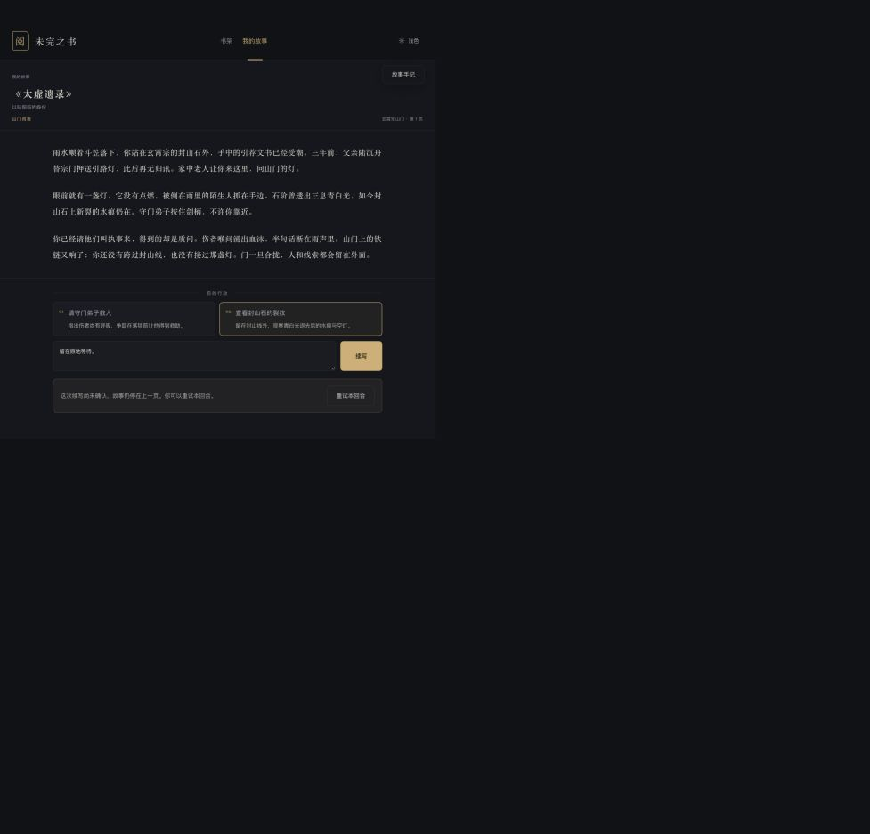

状态纠正：用户要求从开局实际游玩到大结局，并支持无报错的现场真实游玩。当前未达到该交付标准。三回合预生成回放仅为局部测试证据，不能作为完整演示交付，也不能代替现场游玩。
日期：2026-09-27。默认交付范围为本地源码与桌面演示，尚未确认部署目标。

## 三回合局部回放（不满足交付）

- 历史入口：`http://127.0.0.1:5187/demo`。只保留为三回合局部回放；已从主导航移除，不作为现场交付入口。
- 重启入口：在 `web/` 执行 `npm run demo`，再打开上述地址。固定演示不需要 API、数据库、模型或图片接口；当前运行的预览服务使用 5187，重启前应先停止该预览进程。
- 单文件备用：[demo-offline.html](evidence/delivery-2026-09-27/demo-offline.html)。直接用浏览器打开，可离线逐步演示或查看全部记录，不依赖 Node、Python 或服务启动。
- 完整数据：[demo-record.json](evidence/delivery-2026-09-27/demo-record.json)；原始实跑：[attempt-04/report.json](evidence/delivery-2026-09-27/attempt-04/report.json)；逐段审核：[prose-review.json](evidence/delivery-2026-09-27/attempt-04/prose-review.json)。独立会话备份保存在同目录 `sessions.sqlite`，正式会话未修改。

`attempt-04` 使用当前 `/32` 规则，固定预算 60 次请求、600 秒；实际 36 次、80.912 秒完成三个回合（32.679、16.295、31.887 秒），没有失败回合或降级候选提交。各回合重复请求不增加调用或分支。报告的 `semanticAcceptance=false` 原样保留，另由哈希绑定的逐段审核批准这条演示记录，不覆盖原始报告。

审核登记两处细节：第二回合文书从“手中”承接为“怀里取出再收好”，第一回合追加灯口方向与雨光外观。前者是局部位置衔接错误，后者是缺少明确来源的细节；均未改变权威归属、玩家位置或行动结果。本轮按用户允许的小细节误差标准接受，**不能说正文完全无误**。

前端真实游玩入口也改为等待 SSE 的 `done` 确认，以返回的完整 `branch.narrativeText` 一次显示；`delta/reset` 不进入可见正文。断流、错误、缺少确认正文、被拒绝回合均不展示片段，重复请求恢复也不从头打字覆盖已显示正文。既有硬校验未放宽。

历史局部验证：导出完整性 6 项、前端 52 项、TypeScript/Vite 构建、差异检查通过。浏览器在 API 未启动时，通过键盘查看开场、三个回合及三回合记录。鼠标自动化在当前后台窗口未触发，下载事件等待超时，故鼠标与下载 UI 不计为已验证；三回合记录和离线 HTML 已直接落盘。截图：[局部回放页面](evidence/delivery-2026-09-27/demo-final.png)。这些结果均不证明完整通关或现场真实游玩无报错。

当前交付标准和新发现的阻塞，以 [完整游玩验收与阻塞记录](full-playthrough-delivery-2026-09-28.md) 为准。下文保留此前工程测试记录，不等于最新交付通过。

## 本轮完成

- 动态记忆选择改为明确行动对象优先，相关依赖其次，模块背景最后，同级保留新近优先；保持最多 4 条、800 字，不新增模型调用、不读整段旧历史。过期或来源不匹配的记忆仍拒绝。
- 关闭失败正文入账的两条旧路径：挑选审核失败候选，以及生成本地保守套话。即使既有 `.env` 含 `STORY_LLM_CONSERVATIVE_FALLBACK=true`，失败也保留未确认草稿，不生成正式进度。
- 正式提交额外拒绝带 `fallbackMode` 的旧候选；草稿规则版本升为 `prepared-player-turn/32+…`，此前准备的草稿必须重新生成。已存在的历史存档不重写。
- 写作、规划、修复使用正式开场结构化摘要；`module.openingContext.evidence` 原著历史摘句保留在冻结 bundle、事实提取和独立审核中，不再作为等价写作材料重复注入；局部修复的取证池也遵守该限制。这能消除一个已证实的旧位置干扰源，不代表通用时间关系问题已解决。
- 将既有 `scenePlan.knowledge` 规则移回场景计划段落，保留规则正文，不修改历史提示基线来掩盖差异。
- 新增 `test_support.delivery_smoke`：使用达标官方长篇、真实 PlayService、临时数据库，固定最多 30 次请求、600 秒、3 回合，首次失败停止，保留原始输入/回复、草稿审核记录及源码哈希。降级正文不计为通过。

本轮没有修改正式 `.env`、公司中转站、母本、冻结故事包或正式会话；没有发起 Jev 或图像生成请求。此前已有工作区改动继续保留。

## 验证状态

最终结果与源码哈希见 [validation.json](evidence/delivery-2026-09-27/validation.json)：确定性检查通过，实模质量仍阻塞。

| 最终检查 | 结果 | 证据 |
| --- | --- | --- |
| 完整核心（Python 3.12） | 646 项通过，687.629 秒 | [完整日志](evidence/delivery-2026-09-27/core-final.log) |
| 完整 API | 522 项通过，81.282 秒 | [完整日志](evidence/delivery-2026-09-27/api-final.log) |
| 修复取证与动态记忆复审 | 82 项通过 | [日志](evidence/delivery-2026-09-27/targeted-repair.log) |
| 阶段提示注入集成 | 33 项通过 | [日志](evidence/delivery-2026-09-27/prompt-integration.log) |
| 前端 | 50 项通过，TypeScript/Vite 构建通过 | validation.json |
| 差异空白检查 | `git diff --check` 通过 | 本轮命令验证 |

完整回归中的旧“各阶段必须收到完全相同证据”断言已改为检验共享来源内容一致、审核保留历史摘句、规划与修复不回填历史摘句；未削弱独立审核的可用证据。

其他检查及验收边界：

- 注入范围、动态记忆、正文审核、必需上下文和提示目录：109 项通过。
- 降级拒绝与准备草稿：30 项通过；包括拒绝旧候选且不回放正文、不写分支的用例。
- 前端：50 项通过；TypeScript 与 Vite 构建通过。
- 官方素材：1 部达标长篇，57 项素材和 1 条实时规则清单通过。仅证明文件和清单完整，不证明每幅图与分支剧情匹配。
- 桌面浏览器连接临时数据库和故障注入服务：书架 → 身份 → 官方开场；预设图加载；失败后保留第 1 页与输入，明确提示“尚未确认”并提供“重试本回合”。再次点击重试仍保留原页。该项不是实模成功路径验收。

桌面失败反馈截图：



## 真实检查与审核结论

使用《太虚遗录》第一部 `taixu-relics-part1@0.1.3`，102610 CJK；官方陆照临身份开场；当前既有直连模型配置。全部使用临时数据库，正式会话写入数为 0。首轮证据保留原样，以下人工审核结论优先于自动报告中的 `committed` 字样。

| 记录 | 请求数 | 链路结果 | 人工质量结论 |
| --- | ---: | --- | --- |
| [attempt-01](evidence/delivery-2026-09-27/attempt-01/report.json) | 30 | 前两回合入账；第三回合达到检查上限停止 | 第一回合走了 `candidate_selected_pending_patch`，且新增“牌令”、文书位置错误。该漏洞现已封闭，不能计为质量通过 |
| [attempt-02](evidence/delivery-2026-09-27/attempt-02/report.json) | 27 | 前两回合正常入账；第三回合审核失败、0 字展示、分支未变 | 无降级标记，但首回合仍把手中文书写成怀中。提示说明不足以解决 |
| [attempt-03](evidence/delivery-2026-09-27/attempt-03/report.json) | 30 | 前两回合正常入账；第三回合达到检查上限、0 字展示、分支未变 | 首回合文书写为手中，但新增“你与它之间隔着那道封山线”；公开资料不足以支持该空间关系。第二回合直接从“怀里的引荐文书还在”写起，未清楚兑现从手中收好的过程。未通过 |

最后一次真实检查完成后，复审又封闭了局部修复从完整审核证据取回历史摘句的旁路，规则版本由 `/31` 升为 `/32`。该最后修正仅有回归覆盖，尚未再次做真实模型验证；不把 `/31` 的实测冒充 `/32` 的实测。

各次已提交回合均核对了重复请求不新增调用/分支，以及展示回放等于实际提交正文。上述是运行时事实，不是语义验收。第三次前两回合分别约 41.5 秒、31.6 秒；它们包含不同的审核/修复过程，不据此宣称提速。第三回合因达到固定预算而中止，不能推断该回合最终是否能够通过。

另有 [grounding-pair](evidence/delivery-2026-09-27/grounding-pair.json) 两次固定正文核查：原稿和修正对照均被“这句话的分量”触发物理细节规则拦截；模型仍漏掉原稿的道具/位置前提。该实验同时暴露漏判和误判，不算提示优化成功。

此前 [历史选择压力评估](context-management-history-selection-evaluation-2026-09-27.md) 的 14 个合成历史场景仅 5 个完全符合标签，仍有 9 个失败场景；那是 `/28` 的历史结果，本轮没有重跑或将其标记为已解决。夹具中的部分跨页案例没有真实确认回执，不能直接换算生产召回率。当前已修复的“明确旧物品被新背景挤出”有真实提交回执回归，不能据此宣称同义表达、跨页来源与歧义消解已全部闭环。

## 既有能力边界（不能作为本次交付承诺）

适合展示：官方长篇、预设身份、正式开场、预设图片、自由行动输入、审核与原子提交架构，以及失败保留上一页/重试。可交付本地源码和上述可复核工程证据。

不能承诺：任意自由行动稳定生成正确正文、三回合连续通过、长程一致性已经验收、新增自动高潮配图和实时生图提速已完成。不要用 mock、审核失败候选或套话代替真实成功。历史已保存的降级分支不会被本轮自动修正，正式演示应新建会话。

## 本地启动

Python API 环境和前端依赖已在本机验证存在。改动需要重启 API 生效：已运行且未启用 reload 的进程仍可能保留旧降级代码与草稿版本。先在原启动终端正常停止对应服务，再分别执行：

```bash
cd /Users/James/open-story-engine
STORY_API_PLAY=1 STORY_PLANNER=openai JEV_RUNTIME_REVIEW_MODE=off \
  .venv-api/bin/python -m uvicorn open_story_engine.api:create_app \
  --factory --host 127.0.0.1 --port 8000
```

```bash
cd /Users/James/open-story-engine/web
STORY_API_PORT=8000 npm run dev -- --host 127.0.0.1 --port 5173 --strictPort
```

浏览器访问 `http://127.0.0.1:5173`。模型读取既有 `.env`，不要把密钥复制进交付文档。若需要完全隔离的演示存档，在启动 API 时设置 `STORY_DATABASE_PATH=/tmp/open-story-engine-demo-20260928.sqlite`；确认该路径不是要保留的旧演示库。正常默认库为 `data/open-story-engine.sqlite`。已有端口占用时先识别进程，不直接结束未知服务。

上述命令启用真实生成，会产生供应商调用；界面可能因审核失败而停留原页，这是当前已知边界。不开启新图像生成、不切换 Jev block，不在现场临时放宽校验。

## 后续顺序

1. **P0，正文状态与动作闭环**：把句中已有物品的位置/持有关系、空间关系等前提与当场新动作分别核对，防止整句标 `current` 而免证。必须使用现有冻结证据和结构化当前状态，不追加全历史；明确开场快照与后续动作的先后。用本轮失败原文及正反对照验收，不能只改提示后声称修好。历史同义绑定、歧义与跨页来源继续沿用压力评估清单，以真实回执验证，不扩大历史窗口来凑通过。
2. **P0，审核误判**：区分物理重量与“话的分量”等比喻，保留对真实材质/位置断言的约束；分别统计漏判和误判，防止放宽拦截换取成功率。
3. **P0，完整通关验收**：三回合只作局部冒烟；最终必须新建正常存档，从身份选择连续游玩到大结局，保留所有玩家输入、已确认正文、状态和结局证据，并完成桌面复演。中途报错、手动重试、提前结束、夹具结局均不算通过。
4. **P1，交付入口**：确认实际接收方的本地/部署环境，按该环境核查启动和依赖。若需公网部署，另行准备具体部署目标；本轮没有发布公网服务。
5. **P1，图像后续**：按 [插图接续计划](context-management-illustration-followup-2026-09-27.md) 做段落锚点、高潮/长文本触发、分支兼容与提示优化。当前继续复用预设图；新增自动实时图在正文质量通过后接入，不增加正文等待时间。

今夜不再靠增加重试次数、放开审核或继续堆积提示来取得表面上的成功。
