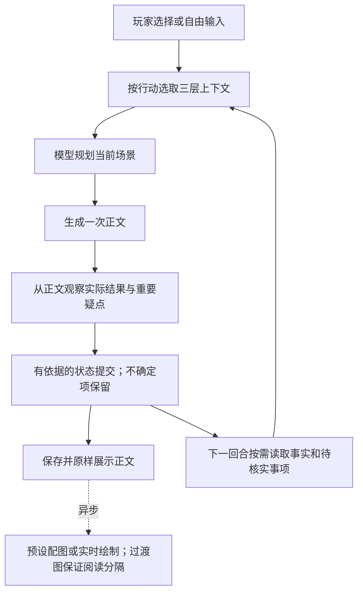

## 2026-09-29 15:00 汇报说明（Asia/Shanghai）

我们用上下文管理工程提高互动小说的连续性：每次写作前，给模型当前需要的原著事实、最近发生的事情和这条路线已经产生的后果；写作后，把能够确认的结果存下来，把重要疑点留到后续核实。玩家已经读到的正文保留原样，小瑕疵不打回重写，也不要求玩家为了审核重试。

按当前“正文基本连贯、行动有回应、可连续游玩、允许小细节误差”的汇报标准，本阶段可以冻结展示。它不是所有自由输入下零错误的保证，也不是动态纠错已经全部完成。最新边界测试和失败过程见[审查记录](evidence/lethal-action-2026-09-28/review.md)。

## 为什么需要做这件事

互动小说与一次性写文章不同。玩家可以随时改变行动，故事还要记住“谁在场、东西在谁手里、刚才到底做了什么”。如果每轮只给一段泛泛摘要，模型容易把上一轮的因果忘掉；如果把整本小说和全部历史都塞进去，又会增加等待、混入无关信息，让关键事实被淹没。

我们的办法是按当前行动选择信息，并区分信息的身份。例如，“守门人声称某人已死”是一条待核实的说法；实际发生并得到正文依据支持的死亡，才是这条路线必须保留的后果。合理的新细节可以补写，但不能悄悄改变玩家的决定或把死者恢复为可互动人物。

## 三层上下文分别管什么

| 层次 | 放什么 | 怎样使用 |
| --- | --- | --- |
| 底层硬规范与事实 | 官方故事包、人物与物品身份、世界规则、当前权威状态、玩家原始行动 | 按当前人物、地点和行动读取有关资料，不靠相似姓名猜身份；既成后果不能被新解释随意覆盖 |
| 短期记忆 | 当前路线最近发生的情节、实际回答、必要原文片段 | 最近两回合原文选择预算合计 1400 字符；本次修复让重大不可逆后果的依据优先于普通关键词匹配 |
| 动态记忆 | 已提交的后果、目标变化、未解决问题及其来源 | 只取当前分支相关的少量记录；已确认事实与待核实事项分开，其他路线的状态不能混入 |

这里的“硬”表示事实和状态的权威边界，不表示用规则逐句检查文学描写。当前没有逐句正文质量审批器。Jev 保持关闭，暂不承担写作、裁决或状态管理。

## 一次行动怎样变成下一页

1. **先理解玩家要做什么。** 保留完整行动，结合在场人物、能力、位置和既成状态规划回应。计划是写作辅助，不是另一个审批关卡；计划提取失败也不因此扣住可交付正文。
2. **正文只写一次。** 当前不运行“写完、逐句审核、打回重写”的链路。界面可能逐步展开已经提交的文字，这种阅读动画不是边显示边撤回改写。
3. **按正文实际发生的事情记账。** 模型提取人物、位置、物品、后果、目标和疑点；程序检查实体 ID、原文段落、信息来源和状态是否合法。计划说要杀死、正文却写被挡住，就不能登记死亡。
4. **保存和展示。** 不可靠的状态提取只产生诊断或待核实事项，不触发正文质量退回。空输出、接口故障、存储失败仍是真实技术故障，不能伪装成成功。
5. **下一轮自然承接。** 已确认后果进入状态和动态记忆；重要疑点按相关性进入后续上下文，模型可通过调查、问答或实际行动澄清，再登记解决。

生成和观察仍依赖外部模型，所以等待时间会变化。本次最终边界记录的四次行动约为 20、27、16、22 秒，这是这四次调用的测量，不是服务时限承诺。

## 动态纠正究竟能做什么

可以理解为“有依据地补齐后续”，但不是把每个小错误都记成一张纠错工单。

- **确认的事实**：用结构化状态保存，例如某人已死亡、玩家已到偏厅；带上产生该事实的回合和原文依据。
- **重要但未核实的事项**：用 `continuityFollowups` 保存问题、状态、涉及实体和证据。它是待查事项，不是已判定错误清单。
- **后续有了进展**：同一问题更新进展；只有正文真的查清或完成，才登记解决。展示一个“去调查”的选项不算解决。
- **已经显示的历史**：保持原文。后续解释不能以“其实没发生”推翻已经确认的死亡、交付或毁坏。

一般措辞、修辞和无影响的小细节不会逐条记录。模型也可能漏掉重要矛盾，或把问题记得不完整，不能声称自动纠错覆盖所有错误。开发验收时由 Codex 直接阅读真实正文并报告问题；玩家正常游玩时，并没有一个 Codex 在后台逐回合人工审稿。

## 这次边界测试说明了什么

玩家输入“杀死某人”，**必须得到行动层面的回应，但不等于无视世界条件必定成功**。有人阻挡时，要写清动作、阻挡和实际结果；已经成功时，则必须记住死亡并承接其后果。

本次实际测了两个方向：

| 情形 | 实际结果 | 后续 |
| --- | --- | --- |
| 顾长离在试炼中攻击陆照临 | 攻击被挡住，执事介入，没有虚报死亡 | 玩家接受退出后离开试炼场，路线继续 |
| 陆照临杀死山门外伤者 | 最终复测中正文完成行动，死亡登记为永久后果，救助目标标为已放弃 | 玩家承认行为、被押入石牢，随后向看守问话并取水；死者未复活，死亡来源回合保持不变 |

调试中确实发现过“正文死亡但状态漏记”“救助被误记成功”“承认被写成否认”。没有把这些问题当作小瑕疵掩盖。修复包括：明确未具名人物的独立 ID、使用原文称呼和段号、本回合新实体的身份与结果分别取证（同一显式 ID 连接、结果段由程序取原文），以及在短期记忆中优先保留重大后果依据。没有增加模型审核调用，没有改写旧记录。

[最终五页记录](evidence/lethal-action-2026-09-28/attempt-09/export/player-record.html)覆盖开局和四次行动；[检查结果](evidence/lethal-action-2026-09-28/verification-release.json)列出原文哈希、持久后果和耗时。这证明了这条边界路径可用，不代表所有人物、所有行动组合均已遍历，也不是通关证明。旧失败与提取诊断继续保留。

## 配图怎样配合阅读

配图异步进行，正文不等出图。连续短页按第 4、7、10……页补图；达到当前长页阈值（1000 汉字）时，在正文中段按段落边界插图。优先使用适合场景的预设素材，没有合适可用素材时尝试私人绘制。

外部绘制可能超时；规定位置先显示明确标注的水墨过渡图，生成成功后再替换图片。过渡图不冒充真实剧情插画，正文不会跟着改写。当前真实绘制探测曾超时，不能汇报成“外部接口每次都能按时出图”。详见[配图验证](evidence/image-cadence-2026-09-28/review.md)。

## 尚未解决的具体缺陷

最终记录第三、四回合的正文已经在石牢内，位置台账仍停留在“石阶下”，连续两回合未自动补齐。这是状态提取缺陷，不能包装成动态纠错已成功；本次后续仍按实际正文承接，没有退回山门。另有松刀、进门动作重复，以及看守对问话限制的扩写。当前验收结论限于正文可持续阅读、明确行动得到回应和死亡后果保留，不包括全部位置记账正确。

本次提交后的补充更新：已将位置观察改为先摘原句再登记地点。在原隔离记录上真实续玩一回合后，玩家位置从“石阶下”补记为“石室”，死亡后果不变；旧记录不回填。历史正文重提取仍出现“靠里的一间”等偏泛名称，不能称为地点抽取全面稳定。回看旧页改为立即显示，减少逐字重播等待。具体结果与限制见[小问题修复记录](evidence/location-followup-2026-09-28/review.md)。

## 2026-09-28 17:00 冻结时记录的后续改进项

1. **实体与证据提取稳定性**：跨句代词、混合对白、地点俗称仍可能漏记；优先用结构化引用和事实包改善，不按相似名称自动合并。
2. **更长路线的因果保留**：这次确认了近期重大后果的承接；长距离回忆、多人同场和多条疑点交错仍要专项实测。
3. **自动纠偏的准确度**：分别衡量发现了多少真实问题、错报多少、后续是否确实解决，不能只统计“写了多少纠错记录”。
4. **等待时间和插画成功率**：根据真实调用分阶段计时，改善缓存、超时和素材覆盖，避免为了更严格审核增加等待。
5. **Jev 后续实验**：等上下文和状态链路稳定后，先做旁路评估，验证是否能提高质量、降低错报；效果没有证据前，不接回正文放行链路。

汇报重点可以放在“信息选得更准、关键后果存得住、玩家行动有回应、故事能连续读下去”。当前成果是可运行、可解释、有真实记录的阶段版本；有限样例通过与全局零缺陷是两件不同的事。
